# Collage Management System

This Android app, built using Flutter for a final year project, is named Collage Management System. The application is fully developed using Flutter and Firebase as the server, utilizing Firebase features such as Fire Auth, Fire Realtime DB, and Firebase Storage.

This app consists of three panels for users:

1. Admin panel
2. Teaching staff panel
3. Office Staff Panel

Each panel has its own set of functionalities.

## Getting Started

This project serves as a starting point for a Flutter application. If this is your first Flutter project, here are some resources to help you get started:

- [Lab: Write your first Flutter app](https://docs.flutter.dev/get-started/codelab)
- [Cookbook: Useful Flutter samples](https://docs.flutter.dev/cookbook)

For further assistance with Flutter development, refer to the [online documentation](https://docs.flutter.dev/), which includes tutorials, samples, guidance on mobile development, and a comprehensive API reference.

## Screenshots

  
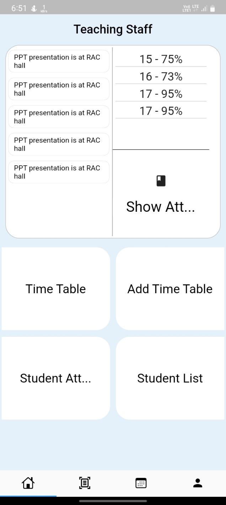

  

  
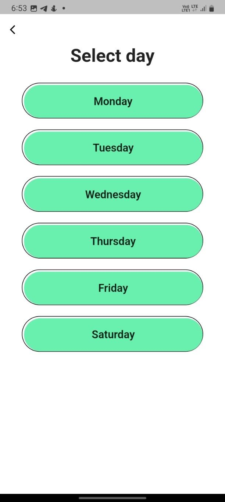

  
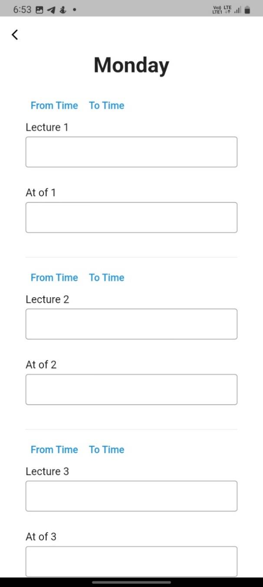

  

  

  
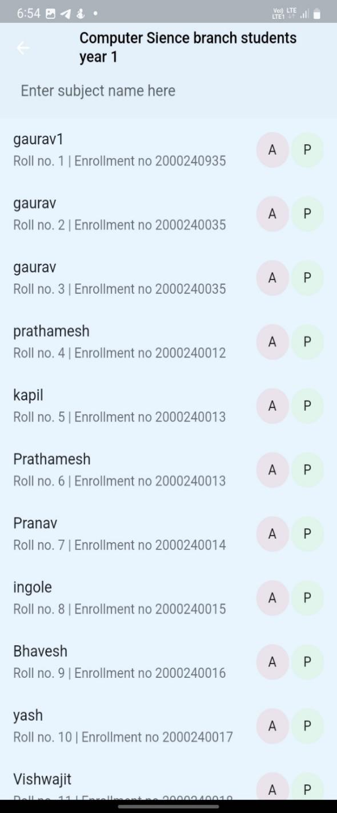

  

  
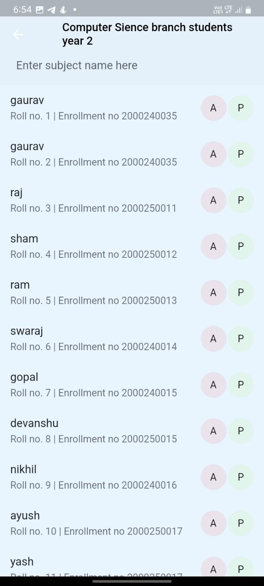

  

  

  

  
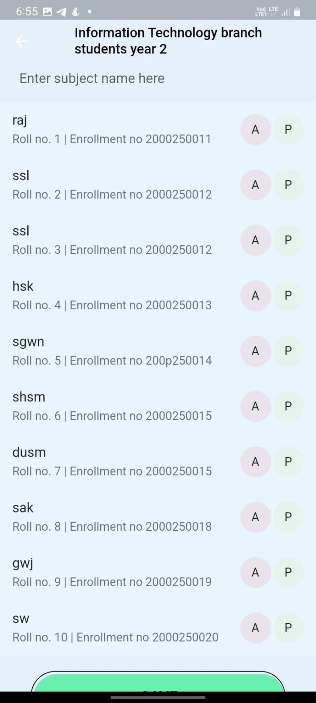

  
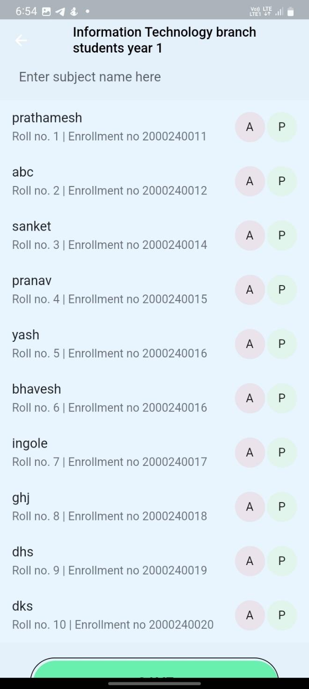

  
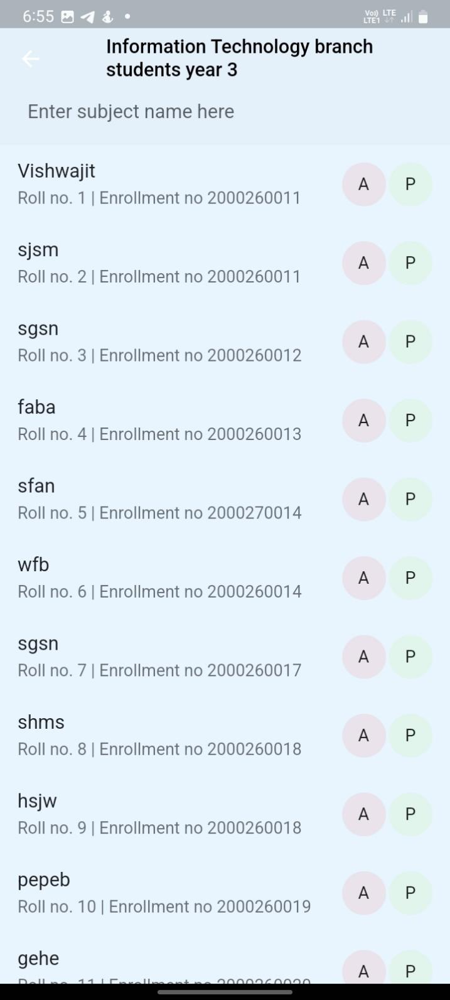

  
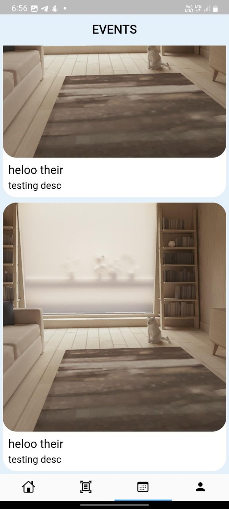

  
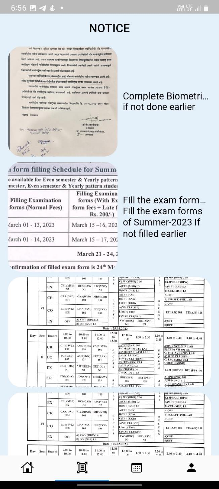

  
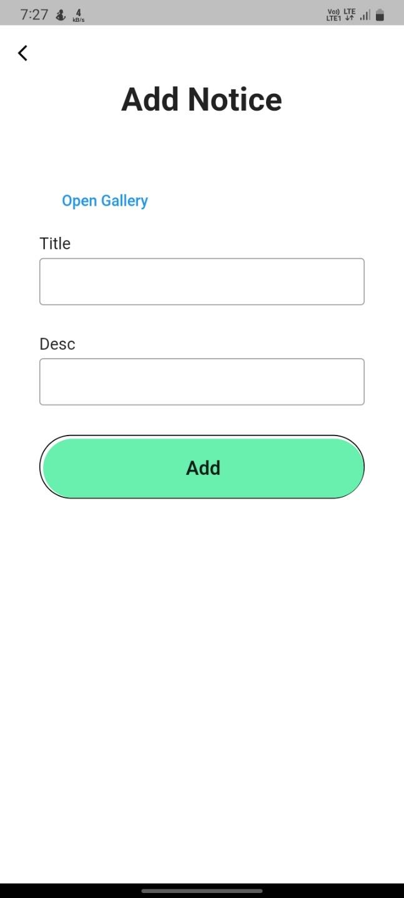

  

  

  
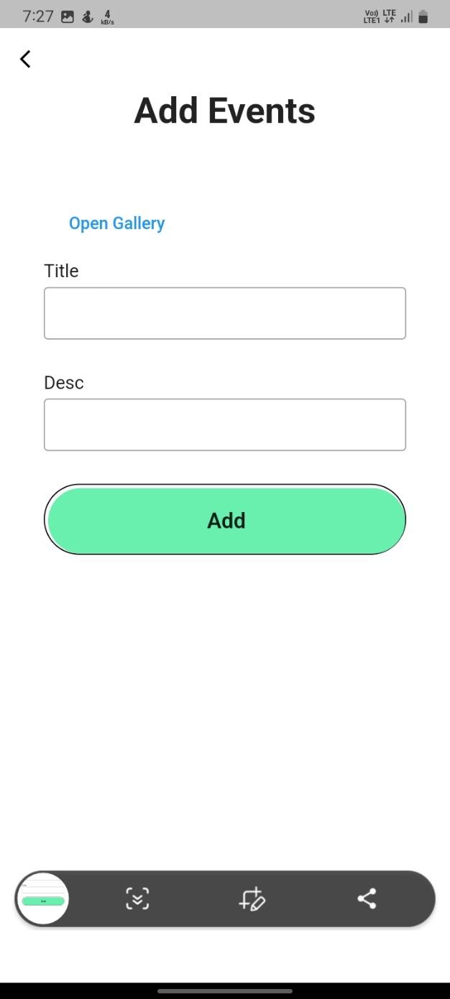

  

  
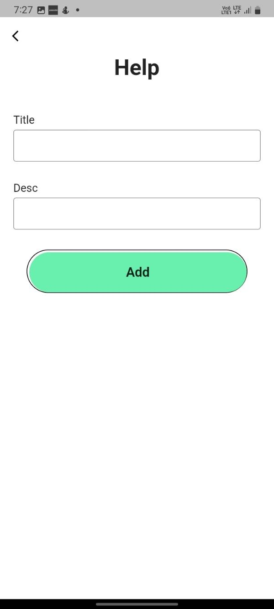

  
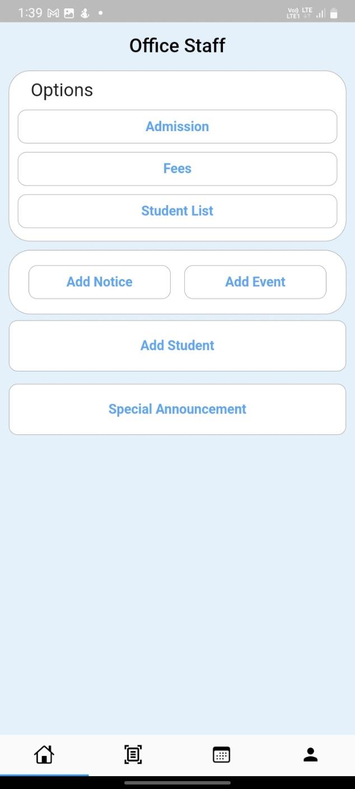

  

  
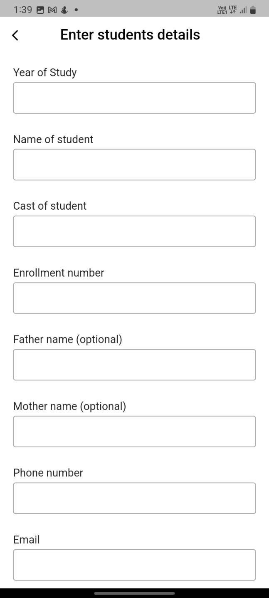

  

  

  

  
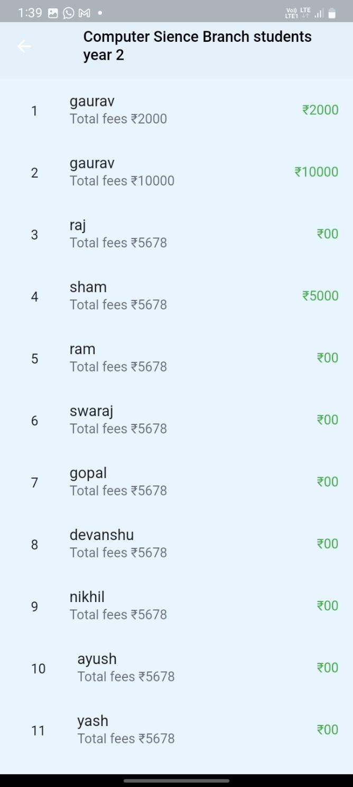

  
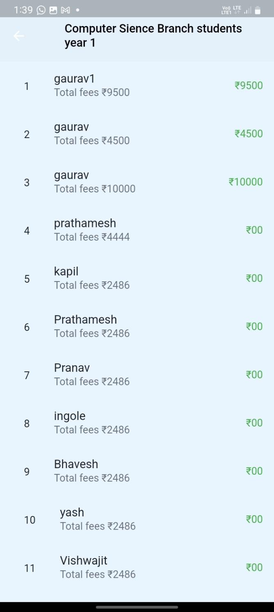

  
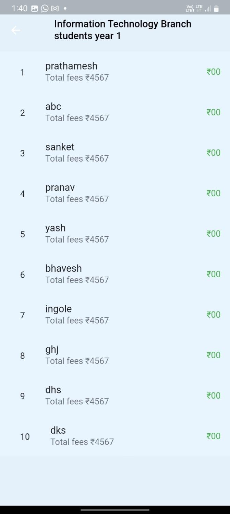

  
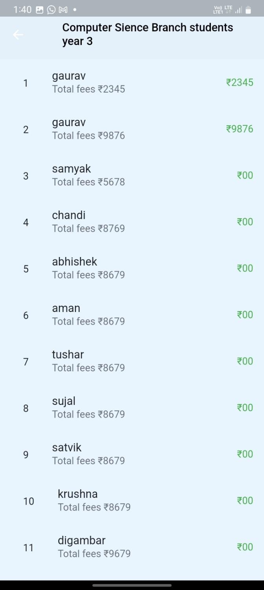

  

  
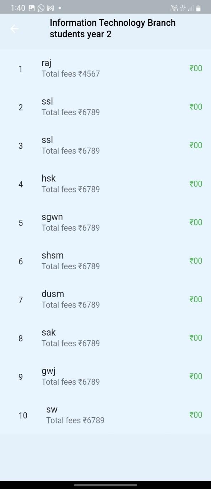

  

  

  

  
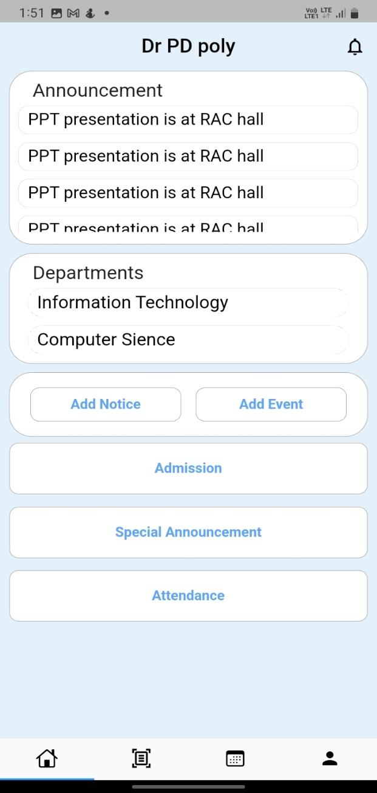

  
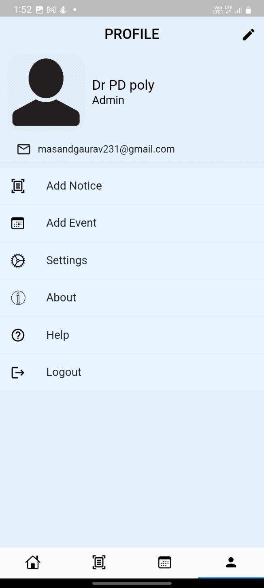

  

